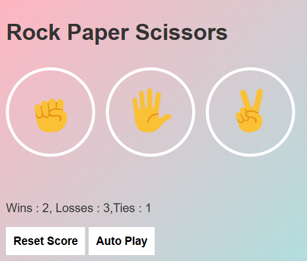

# 🎮 Rock Paper Scissors Game

A simple and fun **Rock Paper Scissors** game built using **HTML, CSS, and JavaScript**.

---

## 🚀 Features

* 🎯 Play against the computer
* 📊 Score tracking (Wins, Losses, Ties)
* 💾 Score saved using Local Storage
* 🎨 Clean and colorful UI
* 🔁 Reset score button
* ▶️ AutoPlay button

---

## 🛠️ Technologies Used

* HTML
* CSS
* JavaScript

---

## 📂 Project Structure

```
project/
│
├── index.html
├── style.css
├── script.js
└── images/
```

---

## ▶️ How to Run

1. Download or clone this repository
2. Open `index.html` in your browser
3. Start playing 🎉

---

## 🎮 How to Play

* Click on **Rock**, **Paper**, or **Scissors**
* The computer will randomly choose a move
* Result will be displayed instantly
* Score updates automatically

---

## 🔮 Future Improvements

* 🎵 Add sound effects
* ✨ Add animations
* ⌨️ Keyboard controls
* 🤖 Smarter AI

---

## 📸 Preview



---

## 🙌 Author

Made by Krishna 🚀
